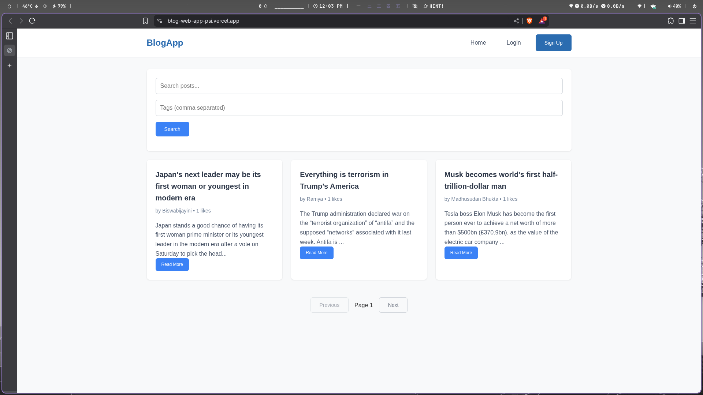
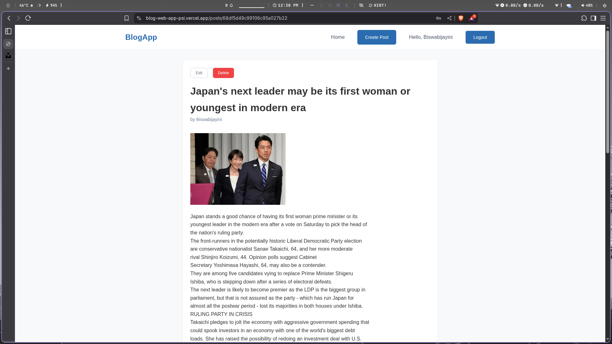
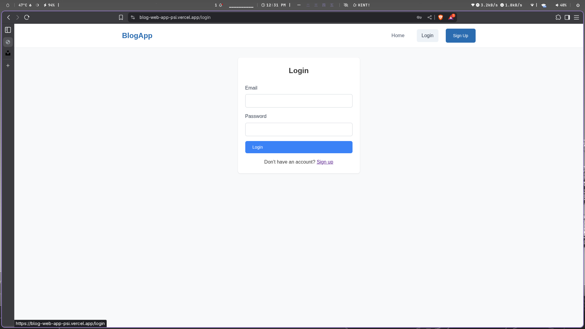

# 🚀 MERN Blog App

A full-stack blogging platform built with the **MERN stack** (MongoDB, Express, React, Node.js).  
It features user authentication, CRUD posts, likes, comments, search, and responsive design.

👉 **Live Demo:** [https://blog-web-app-psi.vercel.app/]  

---

## ✨ Features

- 🔐 **User Authentication & Authorization** (JWT with secure cookies)  
- 📝 **CRUD Operations** for blog posts  
- ❤️ **Like & Comment System** in real-time  
- 🔎 **Search & Filter Posts** by tags  
- 📱 **Responsive UI/UX** for mobile & desktop  
- ⚡ **Pagination & Optimized Performance**  

---

## 🛠 Tech Stack

**Frontend:** React.js, React Router, Context API, CSS  
**Backend:** Node.js, Express.js, MongoDB  
**Authentication:** JWT + Secure Cookies  
**Deployment:** Vercel (Frontend) + Render (Backend)  

---

## 📸 Screenshots

### Homepage


### Blog Post Page


### Login / Signup


---

## ⚡ Challenges I Solved

- Handling **JWT authentication across frontend + backend domains**  
- Implementing **pagination and search filtering**  
- Managing **state across components** with Context API  
- Debugging **CORS & cookie issues during deployment**  

---

## 🚀 Getting Started

Clone the project and install dependencies:

```bash
git clone https://github.com/megabytis/devTinder-WebApp.git
cd devTinder-WebApp

# Backend
cd server
npm install
npm start

# Frontend
cd client
npm install
npm start
```

## 🛣 Roadmap / Future Improvements

 - Add image uploads for posts

 - Rich-text editor for blog content

 - User profiles with bio & avatar

 - Dark mode

## 📬 Contact

Made with ❤️ by Madhusudan Bhukta

If you liked this project, give it a ⭐ on GitHub!
